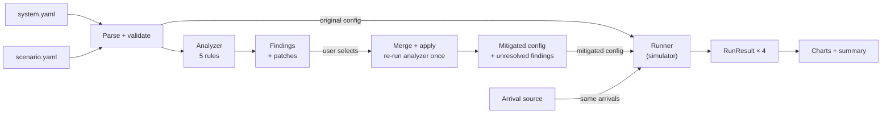
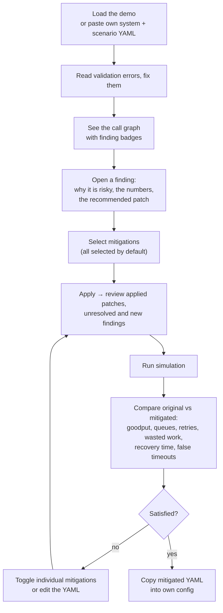
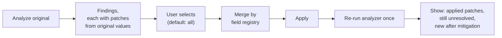
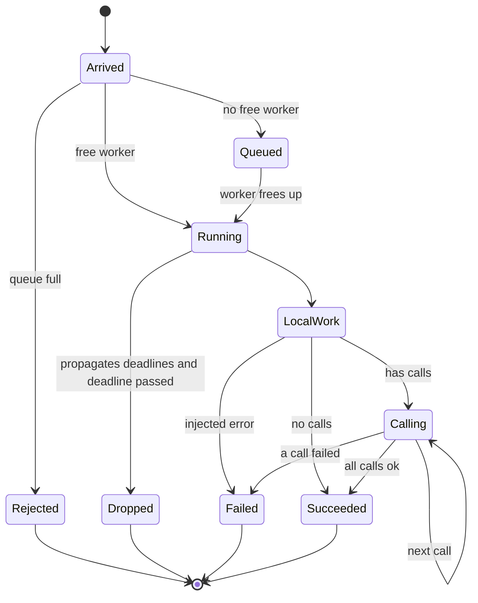
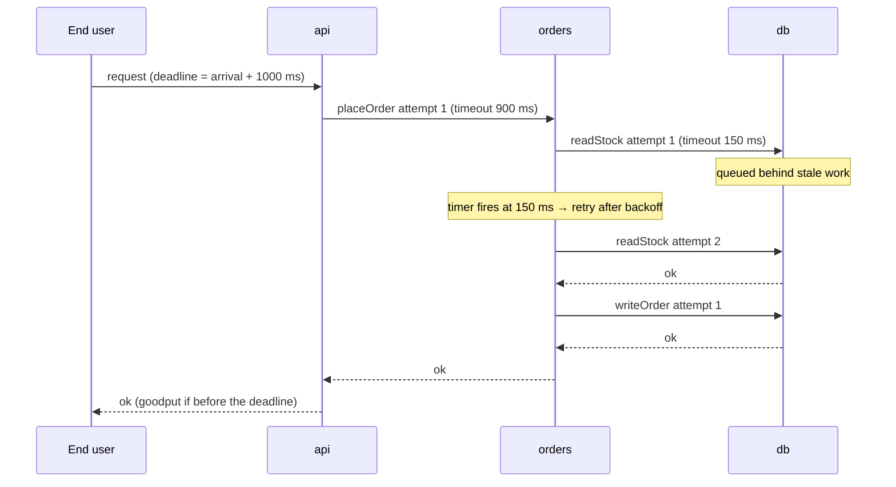
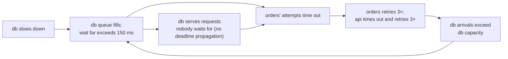

# Config Interaction Analyzer — Design

Status: design agreed, implementation not started · Last updated: 2026-09-27

A browser tool that finds resilience settings which are reasonable per service but risky in combination,
recommends one conservative mitigation per finding, and uses a deterministic discrete-event simulation to show
the failure and the effect of the mitigations.

---

## 1. Problem and goal

Microservices are configured one service at a time: timeouts, retries, queue sizes, worker pools. Each owner picks
values that look sensible locally. When the services call each other, those independent choices compose into
system behavior nobody chose: retry amplification, callers giving up before callees can answer, queues full of
work nobody is waiting for, and failures that **persist after their original cause has gone away**.

The tool makes that composition visible before deployment:

1. **Analyze** the call graph statically and explain which settings are risky together, with the numbers.
2. **Recommend** one conservative mitigation per finding, as a concrete config patch.
3. **Simulate** the original and mitigated configs under the same traffic and fault, and show the difference.

The central demo: a database slows down for 10 seconds. With the original config the system stays broken long
after the database recovers. With the mitigated config it dips during the slowdown and recovers within seconds.

## 2. Scope

**In scope (v1)**

- System config and traffic scenario as two YAML documents, edited in the browser.
- Static analyzer with five rules, each with one conservative mitigation.
- Mitigation pipeline: select findings, merge patches, apply, re-run the analyzer once.
- Deterministic discrete-event simulator; four runs per click (original/mitigated × fault/no fault).
- Charts and summary metrics comparing original vs. mitigated.
- Static site on GitHub Pages; all computation in the browser.

**Out of scope (v1)** — see §13 for placeholders: CLI, LLM features, analytical fixed-point model, robustness check,
circuit breakers, connection pools, parallel fan-out, real config formats, trace replay, real-services backend.

## 3. Architecture



- **Engine** (`src/engine/`): pure TypeScript, no DOM, no React. Config (schema, parsing, validation), analyzer
  (call graph, budget math, rules, mitigation) and simulator. Unit-tested with Vitest. The boundary is enforced by
  a test: no file under `src/engine/` may import React, charting, or anything outside `src/engine/`.
- **UI** (`src/ui/`): React. Reads engine outputs only; holds no domain logic. The only place React is imported.
- The analyzer reads **only the system config**. The simulator reads the system config and the scenario.

## 4. User journey

Persona: a service owner (or an SRE reviewing a change) who wants to know, before deploying, whether a set of
settings is safe in combination.



**Walkthrough with the demo**

1. The user clicks **Load demo**. The graph shows `api → orders → db` with badges on all three services.
2. The top finding reads: *"api → orders retries 3× and orders → db also retries 3×: up to 18 db attempts per user
   request. Recommended: set api → orders maxAttempts 3 → 1."*
3. The user applies all mitigations. The panel lists 12 applied findings and **0 unresolved**.
4. The user runs the simulation. The goodput chart shows the original collapsing at t=10 s and staying near zero
   through t=60 s, while the mitigated line dips and recovers by about t=22 s.
5. The user unchecks the deadline-propagation mitigations, re-applies and re-runs, and sees how recovery changes —
   evidence of which mitigation matters. (Steps 4 and 5 describe expected behavior; the numbers are replaced with
   measured values once the simulator runs.)

## 5. Inputs

All files start with `version: 1`. The parser rejects unknown versions.

### 5.1 System config (read by the analyzer and simulator)

```ts
type Ms = number;

interface SystemConfig {
  version: 1;
  networkLatencyMs: Ms;                        // one-way, per hop
  entry: { service: string; deadlineMs: Ms };  // the end user gives up after deadlineMs; never patched
  services: Record<string, ServiceConfig>;
}

interface ServiceConfig {
  workers: number;                      // thread-per-request concurrency
  queueCapacity: number | 'unbounded';  // FIFO; full → immediate rejection
  serviceTimeMs: Ms;                    // mean local work per request
  serviceTimeJitter: number;            // uniform ±fraction, 0..0.9
  observedP99Ms?: Ms;                   // optional real-world latency; raises the timeout floor
  deadlinePropagation: boolean;         // honor the incoming deadline and pass it on
  calls: CallConfig[];                  // executed sequentially, in this order
}

interface CallConfig {
  name: string;                         // unique within the service; call id = "orders.readStock"
  to: string;
  timeoutMs: Ms;                        // per attempt; covers the network round trip
  maxAttempts: number;                  // integer ≥ 1, includes the first try
  backoff?: { baseMs: Ms; multiplier: number; maxMs: Ms; jitter: 'none' | 'full' };
  retryBudget?: { ratio: number; maxTokens: number };
}
```

### 5.2 Scenario (read by the simulator only)

```ts
interface Scenario {
  version: 1;
  rps: number;                 // Poisson end-user arrivals
  durationMs: Ms;
  warmupMs: Ms;                // excluded from the baseline
  bucketMs: Ms;                // metric bucket size, default 250
  seed: number;
  faults: {
    service: string; startMs: Ms; endMs: Ms;
    latencyMultiplier?: number;  // default 1
    errorRate?: number;          // 0..1, default 0
  }[];
  recovery: { thresholdPct: number; windowMs: Ms; holdMs: Ms };  // default 90, 1000, 3000
}
```

### 5.3 Analyzer options

`{ timeoutFloorMultiplier: 2 }`, editable in the UI.

### 5.4 Validation

Errors are reported with their field path, e.g. `services.orders.calls[1].timeoutMs`.

- `version` is 1; every `to` names an existing service; no self-calls; the call graph is acyclic.
- The entry service exists and has no incoming calls; every service is reachable from the entry.
- Call names are unique within a service.
- Ranges: `workers` integer ≥ 1; `queueCapacity` integer ≥ 0 or `unbounded`; `serviceTimeMs` > 0;
  jitter in [0, 0.9]; `maxAttempts` integer ≥ 1; backoff `multiplier` ≥ 1, other backoff fields ≥ 0;
  retry budget `ratio` in (0, 1], `maxTokens` ≥ 1; `observedP99Ms` > 0.
- `timeoutMs` > rtt and `deadlineMs` > rtt, where rtt = 2 × `networkLatencyMs`.
- Faults: `startMs` < `endMs` ≤ `durationMs`; the first fault starts at or after `warmupMs + windowMs`;
  faults on the same service do not overlap; `latencyMultiplier` > 0; `errorRate` in [0, 1].

## 6. Budget math

Latencies are computed **bottom-up** (leaves first). Budgets are computed **top-down** (entry first), in
topological order. rtt = 2 × `networkLatencyMs`.

| Quantity | Definition | Used for |
|---|---|---|
| svcMax(S) | serviceTimeMs × (1 + jitter) | worst-case local work |
| healthy(call) | rtt + healthy(callee) | floors |
| healthy(S) | svcMax(S) + Σ healthy(call) over S's calls | worst healthy latency, no queueing |
| meanHealthy(S) | serviceTimeMs + Σ (rtt + meanHealthy(callee)) | throughput |
| throughput(S) | min(workers / meanHealthy(S), min over callees C of throughput(C) / k(S,C)) | queue drain rate, in requests/ms; k = calls from S to C per job |
| effectiveBackoff(call) | the call's own backoff; if it retries without one (or with `baseMs: 0`), the rule-3 defaults | worstCase |
| worstCase(call, n, t) | n × t + Σ effectiveBackoff delays for n − 1 retries, at their upper bound | rule 2, elapsedBefore |
| floor(call) | multiplier × max(healthy(call), rtt + callee.observedP99Ms) | lowest safe timeout |
| budget(S) | entry: deadlineMs − rtt; else min over incoming calls c of window(c); clamped at 0 | the time S really has |
| window(c) | min(timeoutMs(c), share(c)) − rtt | the time the callee has for call c |
| elapsedBefore(cᵢ) | svcMax(S) + Σ over j < i of min(worstCase(cⱼ), share(cⱼ)) | order-aware allocation |
| reserve(cᵢ) | Σ over j > i of floor(cⱼ) | keeps room for later calls |
| share(cᵢ) | budget(S) − elapsedBefore(cᵢ) − reserve(cᵢ) | the time call cᵢ may use |
| maxQueueWait(S) | queueCapacity / throughput(S); ∞ if unbounded | rule 5 |

Notes:

- `worstCase` always uses `effectiveBackoff`, everywhere it appears: the backoff the call **will** have after
  mitigation. This prevents rule 3 from breaking a rule-2 fit.
- Units: all formulas use milliseconds and requests/ms. Tables and the UI display throughput in requests/s.
- Earlier calls count at `min(worstCase, share)`: an overrunning earlier call has its own finding, and later calls
  are evaluated as if it were fixed. One bad call does not cascade findings onto every call after it.
- If each call fits its share, all sequential calls together fit the service's budget, and every later call keeps
  at least its floor.
- Worst-case values are for latency bounds; mean values are for capacity.
- Known optimism: a callee shared by several callers is assumed to give each caller its full throughput.

### Worked example: orders in the demo

orders' budget comes from api's call: min(900, 995) − 2 = **898 ms**. Its local work takes up to 7.5 ms. Three
attempts of a db call with default backoff take 3 × 150 + 10 + 20 = 480 ms. Each db call's floor is 2 × 17 = 34 ms.

```
orders budget: 898 ms
|-- local 7.5 --|------------ readStock (share 856.5, needs 480) ------------|-- writeOrder (share 410.5) --|
                                                                            needs 480 → overrun
                                                                            2 attempts need 310 → fits
```

| Call | elapsedBefore | reserve | share | worstCase | Result |
|---|---|---|---|---|---|
| readStock | 7.5 | 34 | 856.5 | 480 | fits |
| writeOrder | 7.5 + 480 = 487.5 | 0 | 410.5 | 480 | overrun → maxAttempts 3 → 2 (310 ≤ 410.5) |

## 7. The five rules

| # | Rule id | Flags when | Severity | Single mitigation |
|---|---|---|---|---|
| 1 | `retry-amplification` | A call has `maxAttempts > 1` and some call reachable below its callee also retries | high | This call's `maxAttempts` → 1; only the deepest layer retries |
| 2 | `deadline-budget-overrun` | worstCase(call) > share(call) | high | timeout ≤ share: `maxAttempts` → largest n that fits. timeout > share and ⌊share⌋ ≥ ⌈floor⌉: `timeoutMs` → ⌊share⌋. Otherwise: none (unresolved) |
| 3 | `unguarded-retries` | `maxAttempts > 1` and backoff, jitter or retry budget is missing: no `backoff` or `baseMs: 0` = no backoff; `jitter: none` = no jitter; no `retryBudget` = no budget | medium | Add what is missing: backoff 10 ms × 2 up to 100 ms (or `baseMs` → 10 if the object exists), `jitter: full`, retry budget ratio 0.1 with 10 tokens |
| 4 | `missing-deadline-propagation` | `deadlinePropagation: false` | medium | Set it to `true` |
| 5 | `dead-on-arrival-queue` | maxQueueWait(S) + healthy(S) > budget(S), including unbounded queues | high | `queueCapacity` → ⌊throughput × (budget − healthy) × 0.5⌋ (throughput in requests/ms), minimum 1. If budget ≤ healthy: none |

Degenerate case: if `budget(S) − svcMax(S) ≤ 0`, the analyzer emits one service-level `deadline-budget-overrun`
finding ("local work alone exceeds the time this service has") with no mitigation, and skips rule 2 and rule 5
for that service.

A queue cap turns overflow into fast rejections, which callers retry. That is intended: a rejection costs almost
nothing, while a stale queued request costs a full service time and is retried anyway. It is safe together with a
single retry layer, a retry budget, backoff with jitter and deadline propagation.

### Example finding

```json
{
  "id": "deadline-budget-overrun:orders.writeOrder",
  "rule": "deadline-budget-overrun",
  "severity": "high",
  "target": { "service": "orders", "call": "writeOrder" },
  "title": "orders → db (writeOrder) can outlast the time orders has",
  "explanation": "orders has 898 ms. Local work and readStock can take up to 487.5 ms first, leaving 410.5 ms. writeOrder's 3 attempts can take 480 ms, so later attempts run after api has given up.",
  "evidence": { "budgetMs": 898, "elapsedBeforeMs": 487.5, "shareMs": 410.5, "worstCaseMs": 480, "floorMs": 34 },
  "mitigation": {
    "summary": "Reduce attempts to 2 (worst case 310 ms)",
    "patches": [{ "target": { "service": "orders", "call": "writeOrder" }, "field": "maxAttempts", "from": 3, "to": 2 }]
  }
}
```

## 8. Mitigation pipeline



**Field registry** (`mitigation/patchableFields.ts`) — a plain table in code. Only these fields may be patched; anything else is a bug caught by a test.

| Field | Level | Conservative direction | Merge when two patches collide |
|---|---|---|---|
| `timeoutMs` | call | lower | minimum |
| `maxAttempts` | call | lower | minimum |
| `backoff` | call | add if absent | keep existing |
| `backoff.baseMs` | call | higher (only ever raised from 0) | maximum |
| `backoff.jitter` | call | `full` | `full` |
| `retryBudget` | call | add if absent | keep existing |
| `queueCapacity` | service | lower (`unbounded` is highest) | minimum |
| `deadlinePropagation` | service | `true` | `true` |

Example collision: rules 1 and 2 both patch `api.placeOrder.maxAttempts` to 1 → 1. If one said 2 and the other 1,
the result would be 1.

**Invariant (tested):** no patch raises a timeout, `maxAttempts`, a queue capacity, or the entry deadline.
Backoff may increase (rule 3), which rule 2 accounts for in advance through `effectiveBackoff`.

**Not guaranteed in general:** a clean re-run. Lowering a timeout shrinks the callee's budget and can create new
findings, which the UI labels "new after mitigation". The demo re-runs clean.

## 9. Simulator

### 9.1 Execution model

Each request holds one worker for its whole life, including while waiting on downstream calls and during backoff.



- Local work = serviceTimeMs × uniform(1 − jitter, 1 + jitter) × the active fault's latency multiplier.
- Dropped jobs cost no worker time.
- Every failure (rejection, error, timeout, expired, downstream failure) is retryable; operations are idempotent.

### 9.2 One call, attempt by attempt

Example with the mitigated config (the original has no backoff).



The **client policy** is two small pure functions that make every per-attempt decision:

```ts
interface AttemptState {
  attempt: number;       // 1-based
  remainingMs: number;   // Infinity if the caller does not propagate deadlines
  tokens: number;        // retry-budget tokens available
  draw: number;          // keyed random in (0, 1) for backoff jitter
}

// How long may this attempt take?
function attemptTimeout(call: CallConfig, state: AttemptState): number;

// After a failed attempt: retry, and after what delay?
function afterFailure(call: CallConfig, state: AttemptState): { retry: false } | { retry: true; delayMs: number };
```

- Attempt timeout = min(timeoutMs, remaining) when the caller propagates deadlines, else timeoutMs.
- Each attempt carries the deadline `send time + attempt timeout − networkLatencyMs` (room for the return hop).
  A callee that propagates deadlines adopts it; one that does not ignores it.
- Response vs. timer: the first event wins. On a tie, the **timeout wins** (success requires strictly earlier).
- Retry after a failure only if attempts remain, the deadline (if known) has not passed, and a retry-budget token is
  available when a budget is configured. The retry waits for the backoff delay.
- Backoff before retry k: d = min(baseMs × multiplier^(k−1), maxMs); `jitter: full` → uniform(0, d); `none` → d.
- Retry budget: one token bucket per call, shared by all jobs of that service. Starts full at `maxTokens`. Each first
  attempt adds `ratio` tokens (capped); each retry spends 1. Retries never earn tokens.
- End users send one attempt and never retry.

### 9.3 Randomness: identical across runs by construction

- **Arrivals** are pre-generated by the arrival source from a dedicated stream seeded by `seed`, then fed into the
  event queue one at a time. Both runs receive exactly the same arrival timestamps.
- **Every other draw** comes from a counter-based hash of its logical identity:
  `rand(seed, rootRequestId, hopPath, purpose, index)` → uniform in (0, 1).
  - `hopPath` is the sequence of (call, attempt) pairs from the user down to this job, so it already identifies
    which attempt the job serves.
  - `purpose` is `service-time`, `error` or `backoff`.
  - `index` distinguishes repeated draws of the same purpose within one job, e.g. backoff before retry 1 vs. retry 2.
  - Example: request 812, hop path `api.placeOrder#1 > orders.readStock#2`, purpose `service-time`, index 0 is the
    db's service time for the second attempt of readStock.
- Keys never include event time, event sequence or global job counters, which differ between runs.
- Keys are encoded as integers and mixed with a 32-bit `Math.imul` finalizer.
- Result: the same logical work gets the same random value in every run; the runs differ only where the configs
  make them differ.

```ts
type ArrivalSource = (scenario: Scenario) => number[];  // sorted timestamps, ms

interface Runner {
  run(system: SystemConfig, scenario: Scenario, arrivals: number[]): RunResult;
}
interface RunResult {
  buckets: BucketMetrics[];
  requests: { arrivalMs: number; completionMs: number | null; ok: boolean }[];
}
```

Events are ordered by (time, sequence number). A global event cap stops runaway runs with a clear error.

### 9.4 Why the original stays broken



After the slowdown ends, the db is fast again but its queue is still full of stale requests. Every request it
serves has already been abandoned, callers keep retrying, and the loop sustains itself. The mitigations break
the loop at several points: a single retry layer and a retry budget cap the amplification, deadline propagation
drops stale work at no cost, and bounded queues keep waits inside the callers' deadlines.

### 9.5 Four runs per click

Original and mitigated, each with the scenario's faults and with no faults. The no-fault runs detect false
timeouts: a mitigation that set a timeout too tight shows timeouts under normal load.

## 10. Metrics and UI

### 10.1 Metrics (250 ms buckets)

| Scope | Metrics |
|---|---|
| Global | user arrivals, goodput (successes within the user deadline, by completion time), late successes, failures |
| Per service | arrivals (first attempt vs retry), rejections, expired drops, max queue depth, utilization, wasted-work fraction |
| Per call | attempts, retries, timeouts, failures |
| Latency | p50 / p99 over 1 s windows (250 ms buckets are too small for percentiles) |

- **Wasted work** = worker time spent on a job whose caller had already given up. When a job ends, its worker time
  is added to every bucket it spanned, so fractions never exceed 1. Only direct abandonment counts (a lower bound).
- **Utilization** is accounted the same way.

### 10.2 Recovery

Computed from `RunResult.requests`, independent of bucket size.

- **Success ratio** of a window = requests that *arrived* in it and succeeded within their deadline ÷ arrivals in it.
  Using arrivals as the denominator removes arrival noise; a healthy system sits near 100%.
- **Baseline** = success ratio from `warmupMs` to the first fault's start.
- **Recovered at** = the earliest t after the last fault ends such that every 1 s window of arrivals starting in
  [t, t + 2 s] (so covering [t, t + 3 s]) has a success ratio ≥ 90% of the baseline.
- Candidate times t and window starts lie on a fixed 100 ms grid, independent of `bucketMs`.
- Requests arriving in the last `deadlineMs` of the run have no final outcome and are excluded. If the hold cannot
  be confirmed, the run reports **did not recover within the run**.

Example: the mitigated run's windows reach ≥ 90% at t = 21.4 s and stay there → recovery time 1.4 s.

### 10.3 Layout

```
+----------------------------------------------------------------------------------------+
|  Config Interaction Analyzer            [Load demo] [Apply selected] [Run simulation]   |
+----------------------+-------------------------------+----------------------------------+
| [System] [Scenario]  |          call graph           |  Findings (12)                   |
|                      |                               |  [x] high  retry amplification   |
|  YAML editor         |   api ──► orders ══► db       |      api → orders: 3 → 1         |
|                      |    ●5      ●5       ●2        |  [x] high  deadline overrun ...  |
|  validation errors   |   (edges: timeout · attempts) |  ---- after apply ----           |
|                      |                               |  applied 12 · unresolved 0       |
+----------------------+-------------------------------+----------------------------------+
|  Summary: baseline · during fault · after · recovery time · false timeouts (orig | mit)  |
|  [goodput + threshold]  [queue depth]  [first vs retry arrivals]  [wasted work]         |
|  service picker for the last three charts (default: faulted service)                    |
+----------------------------------------------------------------------------------------+
```

All charts overlay original vs. mitigated with the fault window shaded.

Badges count findings per service. A call's findings count on the **calling** service (the one that owns the
setting); the edge is highlighted when one of them is selected. Demo: api 5, orders 5, db 2 = 12.

## 11. Demo

### 11.1 Configs

```yaml
# system.yaml
version: 1
networkLatencyMs: 1
entry: { service: api, deadlineMs: 1000 }
services:
  api:
    workers: 200
    queueCapacity: 1000
    serviceTimeMs: 2
    serviceTimeJitter: 0.5
    deadlinePropagation: false
    calls:
      - { name: placeOrder, to: orders, timeoutMs: 900, maxAttempts: 3 }
  orders:
    workers: 200
    queueCapacity: 1000
    serviceTimeMs: 5
    serviceTimeJitter: 0.5
    deadlinePropagation: false
    calls:
      - { name: readStock,  to: db, timeoutMs: 150, maxAttempts: 3 }
      - { name: writeOrder, to: db, timeoutMs: 150, maxAttempts: 3 }
  db:
    workers: 4
    queueCapacity: 1000
    serviceTimeMs: 10
    serviceTimeJitter: 0.5
    deadlinePropagation: false
    calls: []
```

```yaml
# scenario.yaml
version: 1
rps: 140              # 280 db requests/s against 400/s capacity: 70% utilized
durationMs: 60000
warmupMs: 2000
bucketMs: 250
seed: 42
faults:
  - { service: db, startMs: 10000, endMs: 20000, latencyMultiplier: 5 }   # db capacity 400/s → 80/s
recovery: { thresholdPct: 90, windowMs: 1000, holdMs: 3000 }
```

### 11.2 Derived numbers

| Service | svcMax | healthy | meanHealthy | throughput | budget | maxQueueWait + healthy |
|---|---|---|---|---|---|---|
| api | 3 | 46.5 | 33 | 200/s (limited by orders) | 998 | 5046.5 |
| orders | 7.5 | 41.5 | 29 | 200/s (limited by db, 2 calls/job) | 898 | 5041.5 |
| db | 15 | 15 | 10 | 400/s | 148 | 2515 |

| Call | share | worstCase | floor |
|---|---|---|---|
| api.placeOrder | 995 | 2730 | 87 |
| orders.readStock | 856.5 | 480 | 34 |
| orders.writeOrder | 410.5 | 480 | 34 |

### 11.3 Expected findings (12)

| Rule | Target | Patch |
|---|---|---|
| retry amplification | api.placeOrder (up to 18 db attempts per user request) | maxAttempts 3 → 1 |
| deadline overrun | api.placeOrder (2730 > 995) | maxAttempts 3 → 1 (merges with the above) |
| deadline overrun | orders.writeOrder (480 > 410.5) | maxAttempts 3 → 2 |
| unguarded retries | api.placeOrder, orders.readStock, orders.writeOrder | add backoff, jitter, retry budget |
| missing propagation | api, orders, db | deadlinePropagation → true |
| dead-on-arrival queue | api | queueCapacity 1000 → 95 |
| dead-on-arrival queue | orders | queueCapacity 1000 → 85 |
| dead-on-arrival queue | db | queueCapacity 1000 → 26 |

Re-run after applying all: 0 unresolved, 0 new.

| Decision | Margin |
|---|---|
| readStock fits with 3 attempts (480 ≤ 856.5) | 376.5 ms |
| writeOrder is flagged (480 > 410.5) | 69.5 ms |
| mitigated writeOrder fits (310 ≤ 410.5) | 100.5 ms |
| mitigated placeOrder fits (900 ≤ 995) | 95 ms |
| mitigated queues: api 521.5 ≤ 998, orders 466.5 ≤ 898, db 80 ≤ 148 | ≥ 68 ms |

### 11.4 Expected behavior and acceptance criteria

- **Original:** goodput collapses during the fault and stays near zero after it ends.
- **Mitigated:** goodput drops during the fault (bounded by the db's reduced capacity) and recovers shortly after.

Acceptance, checked for seeds 1–5:

- The original does **not** recover within the run.
- The mitigated config recovers within **5 s** of the fault ending.
- With no fault, both configs stay above the recovery threshold after warm-up.
- With no fault, the mitigated config has essentially zero timeouts.

If calibration misses these, tune `rps`, db `workers` or the fault multiplier, and update §11.

## 12. Build, test, deploy

**Stack:** TypeScript, React + Vite, `yaml`, Recharts, Vitest.

```
src/
  engine/                  pure TypeScript; nothing here imports React or code outside src/engine/
    config/
      schema.ts            input types (§5)
      parse.ts             YAML text → plain object
      validate.ts          plain object → typed config, or errors with field paths
    analyzer/
      analyze.ts           entry point: analyze(config) → findings + budgets
      callGraph.ts         topological order, reachability, callers
      budget.ts            latencies, throughput, floors, budgets, shares (§6) → Budgets
      finding.ts           Finding, Patch, Mitigation types
      rules/               one file per rule; index.ts exports RULES, a plain array
      mitigation/
        patchableFields.ts the field table (§8)
        applyMitigations.ts merge, apply, re-run once → MitigationResult
    simulator/
      types.ts             Runner, RunResult, BucketMetrics, ArrivalSource, client-policy types
      run.ts               the event loop: workers, queues, deadlines, faults
      metrics.ts           bucket accounting: time slicing, utilization, wasted work
      arrivals.ts          poissonArrivals
      keyedRandom.ts       identity-keyed random draws (§9.3)
      eventQueue.ts        binary heap ordered by (time, sequence)
      clientPolicy.ts      attemptTimeout, afterFailure
      recovery.ts          success ratio, baseline, recovered-at (§10.2)
      summary.ts           numbers for the summary cards
      compare.ts           compareRuns: shared arrivals, four runs
  ui/
    App.tsx                state: config text, analysis, selected findings, results
    ConfigEditor.tsx       System and Scenario tabs, validation errors
    CallGraphView.tsx      services, calls, finding badges
    FindingsPanel.tsx      findings and patches; after Apply: applied, unresolved, new, mitigated YAML
    ResultsPanel.tsx       summary cards and the four charts
  demo/                    system.yaml, scenario.yaml, index.ts (raw-text import; outside the engine)
  main.tsx
tests/                     mirrors src/; tests/engine/boundary.test.ts enforces the engine boundary
.github/workflows/deploy.yml
```

**Tests**

- Validation: each rule has a failing example with the right path.
- Budget math: the demo's derived numbers (§11.2); a call whose share is tighter than its timeout; slack from a
  fast first call flowing to a later call; a greedy first call cannot push later calls below their floors; an
  overrunning first call does not cascade findings; a negative-budget service.
- Rules: a positive and a negative case each; throughput limited by a callee; rule 2 accounting for rule-3 backoff;
  a floor that binds (no mitigation); a "new after mitigation" case.
- Demo: exactly the 12 findings of §11.3; 0 unresolved after one apply.
- Registry (`patchableFields`): the never-raise invariant; patching an unlisted field fails.
- Boundary: no file under `src/engine/` imports React, charting, or code outside the engine.
- Simulator: identical arrivals across runs; same config + seed gives identical metrics; matching per-request draws
  across configs; request conservation per service; wasted fraction never exceeds 1; success ratio stays high in a
  no-fault run; the acceptance criteria of §11.4.

**Deploy:** on push to `main`, GitHub Actions runs tests, builds with Vite (`base: '/config-analyzer/'`) and deploys
to GitHub Pages at `https://rgrandl.github.io/config-analyzer/`. Requires Settings → Pages → Source: GitHub Actions.

**Deliberate simplifications:** one aggregated instance per service; sequential calls only; no connection pools,
circuit breakers or hedging; all failures retryable; zero-cost drops; healthy latencies ignore queueing (the
simulator checks the consequences).

## 13. Extensions (placeholders)

Each entry names the seam it plugs into. Content to be written when the work is picked up.

### 13.1 Robustness check
- Idea: compare original vs. mitigated vs. "no retries" under 1/3/5% random errors, with results from the simulator.
- Seam: Runner, scenario `errorRate`.
- Status: not started. Open questions: TBD.

### 13.2 Bistability check
- Idea: detect configs with two stable states (healthy and overloaded) analytically.
- Seam: new analyzer module.
- Status: not started. Open questions: TBD.

### 13.3 Parallel fan-out
- Idea: allow `{ parallel: [...] }` groups in a call list; budget takes the max within a group.
- Seam: `calls` schema, `budget.ts` budget walk, simulator call step.
- Status: not started. Open questions: TBD.

### 13.4 More knobs: circuit breakers, connection pools, hedging, rate limiting, load shedding
- Idea: one schema field, one rule, one simulator mechanism per knob.
- Seam: field registry rows, rules array, client policy functions (`attemptTimeout`, `afterFailure`).
- Status: not started. Open questions: TBD.

### 13.5 Real config formats
- Idea: adapters from Envoy, Istio, Resilience4j and Spring settings into the normalized schema.
- Seam: parse.ts input side.
- Status: not started. Open questions: TBD.

### 13.6 Incident replay
- Idea: arrival timestamps from request logs; fault curves from observed latencies; topology and service times
  from distributed traces.
- Seam: ArrivalSource, fault model, service-time distribution.
- Status: not started. Open questions: TBD.

### 13.7 Real-services backend
- Idea: generate a small configurable service per config entry, deploy with Docker Compose or Kubernetes, drive it
  with a load generator, inject faults, and convert the metrics into `RunResult`. Compare against the simulator.
- Seam: Runner contract.
- Status: not started. Open questions: TBD.

### 13.8 CLI / CI gate
- Idea: `analyze system.yaml` with a non-zero exit code on high-severity findings.
- Seam: the pure engine, run under Node.
- Status: not started. Open questions: TBD.

### 13.9 LLM explanations
- Idea: natural-language explanations on top of the deterministic findings, never replacing them.
- Seam: Finding objects.
- Status: not started. Open questions: TBD.

### 13.10 Simulation in a Web Worker
- Idea: keep the UI responsive for large scenarios.
- Seam: Runner.
- Status: not started. Open questions: TBD.
