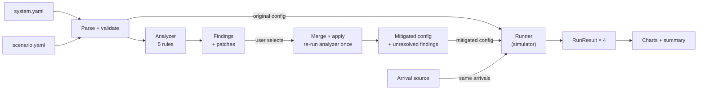
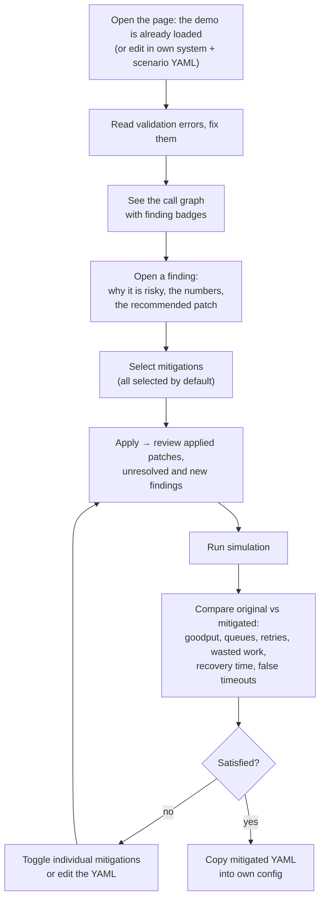
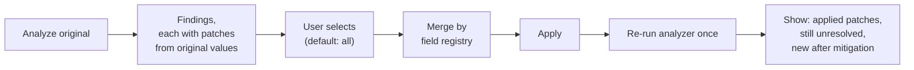
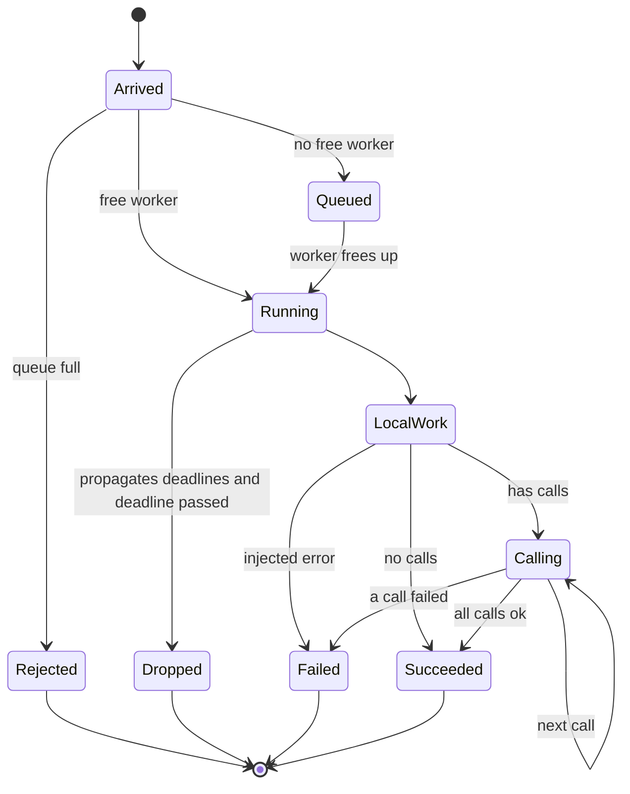
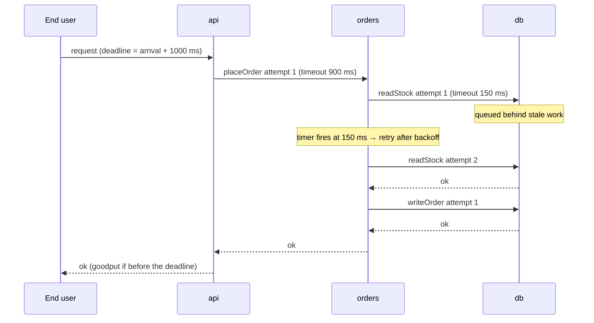
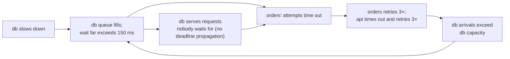

# Config Interaction Analyzer — Design

Status: design agreed, implementation not started · Last updated: 2026-09-27

A browser tool that finds resilience settings which are reasonable per service but risky in combination,
recommends one conservative mitigation per finding, and uses a deterministic discrete-event simulation to show
the failure and the effect of the mitigations.

---

## 1. Problem and goal

Microservices are configured one service at a time: timeouts, retries, queue sizes, worker pools. Each owner picks
values that look sensible locally. When the services call each other, those independent choices compose into
system behavior nobody chose: retry amplification, callers giving up before callees can answer, queues full of
work nobody is waiting for, and failures that **persist after their original cause has gone away**.

The tool makes that composition visible before deployment:

1. **Analyze** the call graph statically and explain which settings are risky together, with the numbers.
2. **Recommend** one conservative mitigation per finding, as a concrete config patch.
3. **Simulate** the original and mitigated configs under the same traffic and fault, and show the difference.

The central demo: a database slows down for 10 seconds. With the original config the system stays broken long
after the database recovers. With the mitigated config it dips during the slowdown and recovers within seconds.

## 2. Scope

**In scope (v1)**

- System config and traffic scenario as two YAML documents, edited in the browser.
- Static analyzer with five rules, each with one conservative mitigation.
- Mitigation pipeline: select findings, merge patches, apply, re-run the analyzer once.
- Deterministic discrete-event simulator; four runs per click (original/mitigated × fault/no fault).
- Charts and summary metrics comparing original vs. mitigated.
- Static site on GitHub Pages; all computation in the browser.

**Out of scope (v1)** — see §13 for placeholders: CLI, LLM features, analytical fixed-point model, robustness check,
circuit breakers, connection pools, parallel fan-out, real config formats, trace replay, real-services backend.

## 3. Architecture



- **Engine** (`src/engine/`): pure TypeScript, no DOM, no React. Config (schema, parsing, validation, call graph),
  analyzer (budget math, rules, mitigation) and simulator. Unit-tested with Vitest. The boundary is enforced by
  a test: no file under `src/engine/` may import React, charting, or anything outside `src/engine/`, and the
  analyzer and the simulator never import each other (what they share lives in `config/`).
- **UI** (`src/ui/`): React. Reads engine outputs only; holds no domain logic. The only place React is imported.
- The analyzer reads **only the system config**. The simulator reads the system config and the scenario.

## 4. User journey

Persona: a service owner (or an SRE reviewing a change) who wants to know, before deploying, whether a set of
settings is safe in combination.



**Walkthrough with the demo**

1. The user opens the page. The demo is already loaded: the graph shows `api → orders → db` with badges on all three
   services, and the 12 findings are listed below it.
2. The top finding reads: *"api → orders retries 3× and orders → db also retries 3×: up to 18 db attempts per user
   request. Recommended: set api → orders maxAttempts 3 → 1."*
3. The user applies all mitigations. The panel lists 12 applied findings and **0 unresolved**.
4. The user runs the simulation. The goodput chart shows both lines at about 140 requests/s before the fault and
   near zero during it. When the fault ends at t = 20 s, the mitigated line jumps straight back to about 140/s, while
   the original stays at 0 through t = 60 s (measured, seed 42; see §11.4).
5. The user unchecks the deadline-propagation mitigations, re-applies and re-runs, and sees how recovery changes —
   evidence of which mitigation matters.

## 5. Inputs

All files start with `version: 1`. The parser rejects unknown versions.

### 5.1 System config (read by the analyzer and simulator)

```ts
type Ms = number;

interface SystemConfig {
  version: 1;
  networkLatencyMs: Ms;                        // one-way, per hop
  entry: { service: string; deadlineMs: Ms };  // the end user gives up after deadlineMs; never patched
  services: Record<string, ServiceConfig>;
}

interface ServiceConfig {
  workers: number;                      // thread-per-request concurrency
  queueCapacity: number | 'unbounded';  // FIFO; full → immediate rejection
  serviceTimeMs: Ms;                    // mean local work per request
  serviceTimeJitter: number;            // uniform ±fraction, 0..0.9
  observedP99Ms?: Ms;                   // optional real-world latency; raises the timeout floor
  deadlinePropagation: boolean;         // honor the incoming deadline and pass it on
  calls: CallConfig[];                  // executed sequentially, in this order
}

interface CallConfig {
  name: string;                         // unique within the service; call id = "orders.readStock"
  to: string;
  timeoutMs: Ms;                        // per attempt; covers the network round trip
  maxAttempts: number;                  // integer ≥ 1, includes the first try
  backoff?: { baseMs: Ms; multiplier: number; maxMs: Ms; jitter: 'none' | 'full' };
  retryBudget?: { ratio: number; maxTokens: number };
}
```

### 5.2 Scenario (read by the simulator only)

```ts
interface Scenario {
  version: 1;
  rps: number;                 // Poisson end-user arrivals
  durationMs: Ms;
  warmupMs: Ms;                // excluded from the baseline
  bucketMs: Ms;                // metric bucket size, default 250
  seed: number;
  faults: {
    service: string; startMs: Ms; endMs: Ms;
    latencyMultiplier?: number;  // default 1
    errorRate?: number;          // 0..1, default 0
  }[];
  recovery: { thresholdPct: number; windowMs: Ms; holdMs: Ms };  // default 90, 1000, 3000
}
```

### 5.3 Analyzer options

`{ timeoutFloorMultiplier: 2 }`, editable in the UI.

### 5.4 Validation

Errors are reported with their field path, e.g. `services.orders.calls[1].timeoutMs`. All errors are collected in
one pass. Validation runs in phases, and a later phase runs only when the earlier ones passed:

1. **Fields:** types, ranges and required fields. Unknown fields are errors, so a typo such as `maxAttempt` is
   caught instead of silently ignored.
2. **References:** the entry and every `to` name existing services; no self-calls; call names are unique within a
   service.
3. **Call graph:** acyclic; the entry has no incoming calls; every service is reachable from the entry.

The rules:

- `version` is 1. YAML syntax errors, including duplicate keys, are reported with their line.
- `services` has at least one service; `networkLatencyMs` ≥ 0.
- Service and call names contain only letters, digits, `_` and `-`. Dots are excluded because call ids
  (`caller.call`) and error paths use them as separators. Names are looked up as own properties, so a name such as
  `constructor` never matches an inherited object key.
- Ranges: `workers` integer ≥ 1; `queueCapacity` integer ≥ 0 or `unbounded`; `serviceTimeMs` > 0;
  jitter in [0, 0.9]; `maxAttempts` an integer in [1, 100] (it also bounds the analyzer's per-attempt loops); backoff `multiplier` ≥ 1, `baseMs` ≥ 0, `maxMs` ≥ `baseMs`;
  retry budget `ratio` in (0, 1], `maxTokens` ≥ 1; `observedP99Ms` > 0.
- `timeoutMs` > rtt and `deadlineMs` > rtt, where rtt = 2 × `networkLatencyMs`.
- Scenario: `rps` > 0; `durationMs` > 0; 0 ≤ `warmupMs` < `durationMs`; `seed` an integer in [0, 2³² − 1]
  (it feeds a 32-bit hash); `recovery.thresholdPct` in (0, 100]; `recovery.holdMs` ≥ `recovery.windowMs` (otherwise no
  window fits in the hold and recovery would be trivially true); `recovery.windowMs` ≥ 100 ms, one step of the
  recovery grid, so consecutive windows leave no gaps. `bucketMs` (250), `recovery` (90, 1000, 3000) and `faults` (none) default
  when omitted.
- Faults: they name an existing service; `startMs` < `endMs` ≤ `durationMs`; the first fault starts at or after
  `warmupMs + windowMs`; every fault ends at or before `durationMs − holdMs − entry.deadlineMs`, so recovery can
  be confirmed after it (the hold contains every window it checks, and the requests it reads need up to the
  deadline to finish); faults on the same service do not overlap (back-to-back is allowed);
  `latencyMultiplier` > 0; `errorRate` in [0, 1]; each fault has an effect (`latencyMultiplier` ≠ 1 or
  `errorRate` > 0).

## 6. Budget math

Latencies are computed **bottom-up** (leaves first). Budgets are computed **top-down** (entry first), in
topological order. rtt = 2 × `networkLatencyMs`.

| Quantity | Definition | Used for |
|---|---|---|
| svcMax(S) | serviceTimeMs × (1 + jitter) | worst-case local work |
| healthy(call) | rtt + healthy(callee) | floors |
| healthy(S) | svcMax(S) + Σ healthy(call) over S's calls | worst healthy latency, no queueing |
| meanHealthy(S) | serviceTimeMs + Σ (rtt + meanHealthy(callee)) | throughput |
| throughput(S) | min(workers / meanHealthy(S), min over callees C of throughput(C) / k(S,C)) | queue drain rate, in requests/ms; k = calls from S to C per job |
| effectiveBackoff(call) | the call's own backoff; if it retries without one, the rule-3 default; with `baseMs: 0`, its own backoff with `baseMs` → 10 and `maxMs` → max(maxMs, 10), so it stays valid | worstCase |
| worstCase(call, n, t) | n × t + Σ effectiveBackoff delays for n − 1 retries, at their upper bound | rule 2, elapsedBefore |
| floor(call) | multiplier × max(healthy(call), rtt + callee.observedP99Ms) | lowest safe timeout |
| budget(S) | entry: deadlineMs − rtt; else min over incoming calls c of window(c); clamped at 0 | the time S really has |
| window(c) | max(0, min(timeoutMs(c), share(c)) − rtt) | the time the callee has for call c |
| available(S) | budget(S) − svcMax(S) | degenerate case (§7) |
| elapsedBefore(cᵢ) | svcMax(S) + Σ over j < i of min(worstCase(cⱼ), max(0, share(cⱼ))) | order-aware allocation |
| reserve(cᵢ) | Σ over j > i of floor(cⱼ) | keeps room for later calls |
| share(cᵢ) | budget(S) − elapsedBefore(cᵢ) − reserve(cᵢ) | the time call cᵢ may use |
| maxQueueWait(S) | queueCapacity / throughput(S); ∞ if unbounded | rule 5 |

Notes:

- `worstCase` always uses `effectiveBackoff`, everywhere it appears: the backoff the call **will** have after
  mitigation. This prevents rule 3 from breaking a rule-2 fit.
- Units: all formulas use milliseconds and requests/ms. Tables and the UI display throughput in requests/s.
- Earlier calls count at `min(worstCase, max(0, share))`: an overrunning earlier call has its own finding, and later
  calls are evaluated as if it were fixed. One bad call does not cascade findings onto every call after it, and a
  negative share never gives time back to later calls.
- Bringing an earlier call within its share can only grow the shares of later calls, so mitigating one sequential
  call cannot create an overrun in the next.
- If each call fits its share, all sequential calls together fit the service's budget, and every later call keeps
  at least its floor.
- Worst-case values are for latency bounds; mean values are for capacity.
- `window` is the first attempt's window; later retries have less time left. That is exact whenever the call fits
  its share (every attempt then still gets its full timeout), and rule 2 fires whenever it does not.
- Known optimism: a callee shared by several callers is assumed to give each caller its full throughput.

### Worked example: orders in the demo

orders' budget comes from api's call: min(900, 995) − 2 = **898 ms**. Its local work takes up to 7.5 ms. Three
attempts of a db call with default backoff take 3 × 150 + 10 + 20 = 480 ms. Each db call's floor is 2 × 17 = 34 ms.

```
orders budget: 898 ms
|-- local 7.5 --|------------ readStock (share 856.5, needs 480) ------------|-- writeOrder (share 410.5) --|
                                                                            needs 480 → overrun
                                                                            2 attempts need 310 → fits
```

| Call | elapsedBefore | reserve | share | worstCase | Result |
|---|---|---|---|---|---|
| readStock | 7.5 | 34 | 856.5 | 480 | fits |
| writeOrder | 7.5 + 480 = 487.5 | 0 | 410.5 | 480 | overrun → maxAttempts 3 → 2 (310 ≤ 410.5) |

## 7. The five rules

| # | Rule id | Flags when | Severity | Single mitigation |
|---|---|---|---|---|
| 1 | `retry-amplification` | A call has `maxAttempts > 1` and some call reachable below its callee also retries | high | This call's `maxAttempts` → 1; only the deepest layer retries |
| 2 | `deadline-budget-overrun` | worstCase(call) > share(call) | high | timeout ≤ share: `maxAttempts` → largest n that fits. timeout > share and share ≥ floor: `timeoutMs` → share (exact; the UI displays it rounded) and, if it retries, `maxAttempts` → 1, in the same mitigation, since a second attempt would need at least twice the share. Otherwise: none (unresolved) |
| 3 | `unguarded-retries` | `maxAttempts > 1` and backoff, jitter or retry budget is missing: no `backoff` or `baseMs: 0` = no backoff; `jitter: none` = no jitter; no `retryBudget` = no budget | medium | Add what is missing: backoff 10 ms × 2 up to 100 ms (if the object exists with `baseMs: 0`: `baseMs` → 10 and `maxMs` → max(maxMs, 10)), `jitter: full`, retry budget ratio 0.1 with 10 tokens |
| 4 | `missing-deadline-propagation` | `deadlinePropagation: false` | medium | Set it to `true` |
| 5 | `dead-on-arrival-queue` | maxQueueWait(S) + healthy(S) > budget(S), including unbounded queues | high | `queueCapacity` → ⌊throughput × (budget − healthy) × 0.5⌋ (throughput in requests/ms), minimum 1. None if the cap would not be smaller than today's queue |

Too slow even when healthy: if `budget(S) < healthy(S)`, the service cannot finish in the time it has even with no
load, because its callers' timeouts (or, for the entry, the user's deadline) are shorter than its own work plus its
calls. The analyzer emits one service-level `deadline-budget-overrun` finding with no mitigation (raising timeouts is
never automatic), and skips rule 2's per-call checks and rule 5 for that service. This covers local work alone
exceeding the budget, and a timeout shorter than the callee's healthy latency. One shared helper decides it for both
rules, so they cannot disagree.

Starved services: a service whose budget is 0 got no time from its callers, because a caller's share was at or
below the round trip. Rule 2 skips it entirely; the caller's own finding explains the cause. Without this, one
upstream problem would produce an unresolvable finding on every service below it. Rule 5 needs no separate check:
a budget of 0 is always below the healthy latency.

Analyzer contracts: `effectiveBackoff` (§6) treats a missing backoff and `baseMs: 0` alike, so rule 3 must flag and
patch both (`backoff` when absent; `backoff.baseMs` → 10 and, if needed, `backoff.maxMs` → 10 when `baseMs` is 0).
The patches produce exactly `effectiveBackoff`, so the budgets never assume a backoff the mitigation does not add.

Comparisons: rules compare times with a tolerance of 1e-9 ms (one shared helper), so a value that lands exactly on
a boundary, such as a worst case equal to its share, is not flipped by floating-point noise.

Mitigated timeouts are set to the exact share rather than rounded down: rounding would shrink the callee's window
by up to 1 ms and could create a "new after mitigation" finding from rounding alone.

A queue cap turns overflow into fast rejections, which callers retry. That is intended: a rejection costs almost
nothing, while a stale queued request costs a full service time and is retried anyway. It is safe together with a
single retry layer, a retry budget, backoff with jitter and deadline propagation.

### Example finding

```json
{
  "id": "deadline-budget-overrun:orders.writeOrder",
  "rule": "deadline-budget-overrun",
  "severity": "high",
  "target": { "service": "orders", "call": "writeOrder" },
  "title": "orders → db (writeOrder) can outlast the time orders has",
  "explanation": "orders has 898 ms. Local work and readStock can take up to 487.5 ms first, leaving 410.5 ms. writeOrder's 3 attempts can take 480 ms, so later attempts run after api has given up.",
  "evidence": { "budgetMs": 898, "elapsedBeforeMs": 487.5, "shareMs": 410.5, "worstCaseMs": 480, "floorMs": 34 },
  "mitigation": {
    "summary": "Reduce attempts to 2 (worst case 310 ms)",
    "patches": [{ "target": { "service": "orders", "call": "writeOrder" }, "field": "maxAttempts", "from": 3, "to": 2 }]
  }
}
```

## 8. Mitigation pipeline



**Field registry** (`mitigation/patchableFields.ts`) — a plain table in code. Only these fields may be patched; anything else is a bug caught by a test.

| Field | Level | Conservative direction | Merge when two patches collide |
|---|---|---|---|
| `timeoutMs` | call | lower | minimum |
| `maxAttempts` | call | lower | minimum |
| `backoff` | call | add if absent | keep existing |
| `backoff.baseMs` | call | higher (only ever raised from 0) | maximum |
| `backoff.maxMs` | call | higher (raised to at least the new `baseMs`) | maximum |
| `backoff.jitter` | call | `full` | `full` |
| `retryBudget` | call | add if absent | keep existing |
| `queueCapacity` | service | lower (`unbounded` is highest) | minimum |
| `deadlinePropagation` | service | `true` | `true` |

Example collision: rules 1 and 2 both patch `api.placeOrder.maxAttempts` to 1 → 1. If one said 2 and the other 1,
the result would be 1.

**Invariant (tested):** no patch raises a timeout, `maxAttempts`, a queue capacity, or the entry deadline.
Backoff may increase (rule 3), which rule 2 accounts for in advance through `effectiveBackoff`.

Applying mitigations (`applyMitigations`):

1. Merge the selected findings' patches: one patch per field, the more conservative value wins. A patch to a field
   outside the table, or in the wrong direction, throws: a faulty rule can never produce a less safe config.
2. Apply them to a copy of the config. Each patch first checks the field still holds the value it expects.
3. Validate the result. Mitigations only tighten valid settings, so an invalid result means a rule is wrong, and it
   throws.
4. Re-run the analyzer once and split its findings into **unresolved** (already present before) and **introduced**
   (new).

**Not guaranteed in general:** a clean re-run. Findings without a safe mitigation stay unresolved, and a partial
selection leaves the unselected findings in place. Introduced findings are not expected with the current rules:
mitigated timeouts equal the share (so windows do not shrink), fewer attempts only grow later shares, and queue caps,
guards and deadline propagation do not change any budget. The split is kept so that a future rule that does shrink a
budget is caught and shown. The demo re-runs clean.

## 9. Simulator

### 9.1 Execution model

Each request holds one worker for its whole life, including while waiting on downstream calls and during backoff.



- Local work = serviceTimeMs × uniform(1 − jitter, 1 + jitter) × the active fault's latency multiplier.
- Dropped jobs cost no worker time.
- Every failure (rejection, error, timeout, expired, downstream failure) is retryable; operations are idempotent.

**Contracts shared with the budget math.** The analyzer's numbers (§6) assume the simulator behaves exactly like
this; if either side changes, both must. The formulas live in `config/semantics.ts` (`backoffDelayMs`,
`localWorkMs`, `localWorkMaxMs`, `carriedDeadlineMs`), which both sides call, so they cannot drift; a test also runs
the demo at low load and checks every latency against the analyzer's `healthy`:

- A job does its local work first, then its calls, in order.
- An attempt's timeout covers the full round trip: the timer starts when the request is sent.
- A callee's carried deadline is send time + attempt timeout − one-way latency, which leaves it exactly
  `window = timeout − rtt`.
- Local work is uniform in serviceTimeMs × [1 − jitter, 1 + jitter], so `svcMax` is its upper bound.
- Backoff delays never exceed min(baseMs × multiplier^(k−1), maxMs).

### 9.2 One call, attempt by attempt

Example with the mitigated config (the original has no backoff).



The **client policy** is two small pure functions that make every per-attempt decision:

```ts
interface AttemptState {
  attempt: number;       // 1-based
  remainingMs: number;   // Infinity if the caller does not propagate deadlines
  tokens: number;        // retry-budget tokens available
  draw: number;          // keyed random in (0, 1) for backoff jitter
}

// How long may this attempt take?
function attemptTimeout(call: CallConfig, state: AttemptState): number;

// After a failed attempt: retry, and after what delay?
function afterFailure(call: CallConfig, state: AttemptState): { retry: false } | { retry: true; delayMs: number };
```

- Attempt timeout = min(timeoutMs, remaining) when the caller propagates deadlines, else timeoutMs.
- Each attempt carries the deadline `send time + attempt timeout − networkLatencyMs` (room for the return hop).
  A callee that propagates deadlines adopts it; one that does not ignores it.
- Response vs. timer: the first event wins. On a tie, the **timeout wins** (success requires strictly earlier).
- Retry after a failure only if attempts remain, a retry-budget token is available when a budget is configured, and
  the backoff delay ends before the deadline (if known). A retry that could only start at or after the deadline is
  never scheduled, so no worker is held waiting for it; the call fails right away instead. The retry waits for the
  backoff delay.
- Backoff before retry k: d = min(baseMs × multiplier^(k−1), maxMs); `jitter: full` → uniform(0, d); `none` → d.
- Retry budget: one token bucket per call, shared by all jobs of that service. Starts full at `maxTokens`. Each first
  attempt adds `ratio` tokens (capped); each retry spends 1. Retries never earn tokens. A retry needs 1 token up to
  a 1e-9 tolerance, because floating point adds ten steps of 0.1 up to slightly less than 1.
- End users send one attempt and never retry.

### 9.3 Randomness: identical across runs by construction

- **Arrivals** are pre-generated by the arrival source from a dedicated stream seeded by `seed`, then fed into the
  event queue one at a time. Both runs receive exactly the same arrival timestamps.
- **Every other draw** comes from a counter-based hash of its logical identity:
  `rand(seed, rootRequestId, hopPath, purpose, index)` → uniform in (0, 1).
  - `hopPath` is the sequence of (call, attempt) pairs from the user down to this job, so it already identifies
    which attempt the job serves.
  - `purpose` is `service-time`, `error` or `backoff`.
  - `index` distinguishes repeated draws of the same purpose within one job, e.g. backoff before retry 1 vs. retry 2.
  - Example: request 812, hop path `api.placeOrder#1 > orders.readStock#2`, purpose `service-time`, index 0 is the
    db's service time for the second attempt of readStock.
- Keys never include event time, event sequence or global job counters, which differ between runs.
- Keys are encoded as integers and mixed with a 32-bit `Math.imul` finalizer.
- Result: the same logical work gets the same random value in every run; the runs differ only where the configs
  make them differ.

```ts
type ArrivalSource = (scenario: Scenario) => number[];  // sorted timestamps, ms

interface Runner {
  run(system: SystemConfig, scenario: Scenario, arrivals: number[]): RunResult;
}
interface RunResult {
  buckets: BucketMetrics[];
  requests: { arrivalMs: number; completionMs: number | null; ok: boolean }[];
  eventCount: number;
  truncated: boolean;   // the run hit the event cap
  endedAtMs: number;    // durationMs, or earlier when truncated
}
```

Events are ordered by (time, sequence number), so ties come out in the order they were scheduled. Arrivals are fed
into the event queue one at a time. A run stops after 5 million events (configurable through
`createSimulator({ maxEvents })`) and returns a partial result marked `truncated`, which the UI shows, instead of
throwing. `eventCount` includes timeout events that fire after their attempt was already answered and do nothing;
they are cheaper to skip than to remove from the heap.

Runs are exactly reproducible on the same JavaScript engine. Arrivals use `Math.log`, which is not guaranteed
bit-identical across engines, so another browser may produce slightly different numbers for the same seed; the
comparison between configs is unaffected, since all its runs happen in the same engine.

Implementation notes:

- The end user is modelled as a caller with one attempt whose timeout is the deadline, so responses, timeouts and
  wasted work need no special cases for it.
- A job's key for random draws is a 32-bit path hash built incrementally from its caller's: `mix(parent, call, attempt)`.
- A response at exactly the timeout is a timeout. The timeout event, scheduled when the attempt is sent, is always
  processed first at equal times; the response handler also checks the time explicitly, so the rule does not depend
  on event order.

### 9.4 Why the original stays broken



After the slowdown ends, the db is fast again but its queue is still full of stale requests. Every request it
serves has already been abandoned, callers keep retrying, and the loop sustains itself. The mitigations break
the loop at several points: a single retry layer and a retry budget cap the amplification, deadline propagation
drops stale work at no cost, and bounded queues keep waits inside the callers' deadlines.

### 9.5 Four runs per click

Original and mitigated, each with the scenario's faults and with no faults. The no-fault runs detect false
timeouts: a mitigation that set a timeout too tight shows timeouts under normal load.

## 10. Metrics and UI

### 10.1 Metrics (250 ms buckets)

| Scope | Metrics |
|---|---|
| Global | user arrivals, goodput (successes within the user deadline, by completion time), late successes, failures |
| Per service | arrivals (first attempt vs retry), rejections, expired drops, completions, max queue depth, utilization, wasted-work fraction |
| Per call | attempts, retries, timeouts, failures |
| Latency | p50 / p99 over 1 s windows (250 ms buckets are too small for percentiles) |

- **Wasted work** = worker time spent on a job whose caller had already given up. When a job ends, its worker time
  is added to every bucket it spanned, so fractions never exceed 1. Only direct abandonment counts, so it is a lower
  bound: a db job whose orders caller is still waiting counts as useful, even if api has already given up on orders.
- **Utilization** is accounted the same way.

### 10.2 Recovery

Computed from `RunResult.requests`, independent of bucket size.

- **Success ratio** of a window = requests that *arrived* in it and succeeded within their deadline ÷ arrivals in it.
  Using arrivals as the denominator removes arrival noise; a healthy system sits near 100%.
- **Baseline** = success ratio from `warmupMs` to the first fault's start.
- **Recovered at** = the earliest t after the last fault ends such that every 1 s window of arrivals starting in
  [t, t + 2 s] (so covering [t, t + 3 s]) has a success ratio ≥ 90% of the baseline.
- Candidate times t and window starts lie on a fixed 100 ms grid (`RECOVERY_GRID_MS` in `config/semantics.ts`),
  independent of `bucketMs`. The hold also gets one window ending exactly at t + hold, so no part of it goes
  unchecked when hold − window is not a multiple of the grid.
- A window exactly at the threshold meets it (ratios are compared with a 1e-12 tolerance).
- Windows with no arrivals are skipped, but at least one window in the hold must have arrivals, so a period of
  silence never counts as recovered.
- Requests arriving in the last `deadlineMs` of the run (before `endedAtMs`) have no final outcome and are
  excluded, and the whole hold must fit before that point. If it cannot be confirmed, the run reports
  **did not recover within the run**.
- Without faults, or with a baseline of 0 (nothing succeeded before the fault, so there is nothing to recover to),
  recovery is **not applicable**; the baseline is still reported.
- If the run was **truncated** before recovery could be confirmed, the status is **unknown** rather than "not
  recovered", since the missing part of the run might have shown either.

Example (a unit test): requests fail until 21.5 s; the 1 s window starting at 21.4 s has exactly 90% successes,
so the run recovers at 21.4 s, 1.4 s after a fault that ended at 20 s.

The summary cards (`summarizeRun`) show, per run: success ratio and goodput before, during and after the faults;
recovery; the lowest window ratio after warm-up; attempts, timeouts and the timeout fraction (false timeouts in a
run without faults); the wasted fraction **per service** (an average across services is dominated by callers that
hold workers while they wait: in the demo's original run it reads 6% overall while the db wastes 100%); and
whether the run was truncated.

### 10.3 Layout

One page, four steps top to bottom. The demo is loaded on the first visit, so a reviewer sees the graph and the 12
findings without a click, and the primary button at the top gets to the results in one click.

```
Config Interaction Analyzer
One paragraph: what the tool does.
+------------------------------------------------------------------------------------------+
| 12 risky combinations across api, orders, db.            [Apply mitigations and simulate] |
+------------------------------------------------------------------------------------------+
1. Configure                                                               [Edit the config]
   "The demo is loaded: ..."  (the editor is collapsed; it opens by itself when there are errors)
   System | Scenario tabs · YAML text · errors listed with their field path · Load demo
2. Review the findings
   +----------------------------------------------------------------------------------+
   |  [api ●5] ── placeOrder: 900 ms × 3 ──► [orders ●5] ── readStock, writeOrder ──► [db ●2] |
   +----------------------------------------------------------------------------------+
   12 findings, 12 selected                                                     [Select none]
   [x] High  title · target · explanation · recommended change (from → to)
3. Apply the mitigations                                                  [Apply 12 selected]
   14 changes applied · re-check: nothing left · applied patches · still unresolved · new
   Mitigated config (YAML), with "Copy into the editor"
4. Simulate                   (4b: loading state, summary cards, charts, explanations)
```

- The call graph runs left to right on wide screens and top to bottom below 700 px, where a left-to-right graph would
  shrink its text below reading size. Selecting a finding highlights its service or call.
- Results that no longer match the config or the selection are kept but marked out of date, with a button to redo
  the step.
- Every panel sits inside an error boundary: if one ever fails to render, it shows the error and the rest of the page
  keeps working. A failure to apply mitigations is shown as a message, and the original config stays usable.
- Visual language: IBM Plex Sans for the interface and IBM Plex Mono only for code (YAML, patch values), bundled
  with the app rather than loaded from a font service. Red is the original config, teal the mitigated one, amber the
  fault; lines also differ in style (solid vs. dashed), so color never carries meaning alone.

Badges count findings per service. A call's findings count on the **calling** service (the one that owns the
setting); the edge is highlighted when one of them is selected. Demo: api 5, orders 5, db 2 = 12.

## 11. Demo

### 11.1 Configs

```yaml
# system.yaml
version: 1
networkLatencyMs: 1
entry: { service: api, deadlineMs: 1000 }
services:
  api:
    workers: 200
    queueCapacity: 1000
    serviceTimeMs: 2
    serviceTimeJitter: 0.5
    deadlinePropagation: false
    calls:
      - { name: placeOrder, to: orders, timeoutMs: 900, maxAttempts: 3 }
  orders:
    workers: 200
    queueCapacity: 1000
    serviceTimeMs: 5
    serviceTimeJitter: 0.5
    deadlinePropagation: false
    calls:
      - { name: readStock,  to: db, timeoutMs: 150, maxAttempts: 3 }
      - { name: writeOrder, to: db, timeoutMs: 150, maxAttempts: 3 }
  db:
    workers: 4
    queueCapacity: 1000
    serviceTimeMs: 10
    serviceTimeJitter: 0.5
    deadlinePropagation: false
    calls: []
```

```yaml
# scenario.yaml
version: 1
rps: 140              # 280 db requests/s against 400/s capacity: 70% utilized
durationMs: 60000
warmupMs: 2000
bucketMs: 250
seed: 42
faults:
  - { service: db, startMs: 10000, endMs: 20000, latencyMultiplier: 5 }   # db capacity 400/s → 80/s
recovery: { thresholdPct: 90, windowMs: 1000, holdMs: 3000 }
```

### 11.2 Derived numbers

| Service | svcMax | healthy | meanHealthy | throughput | budget | maxQueueWait + healthy |
|---|---|---|---|---|---|---|
| api | 3 | 46.5 | 33 | 200/s (limited by orders) | 998 | 5046.5 |
| orders | 7.5 | 41.5 | 29 | 200/s (limited by db, 2 calls/job) | 898 | 5041.5 |
| db | 15 | 15 | 10 | 400/s | 148 | 2515 |

| Call | share | worstCase | floor |
|---|---|---|---|
| api.placeOrder | 995 | 2730 | 87 |
| orders.readStock | 856.5 | 480 | 34 |
| orders.writeOrder | 410.5 | 480 | 34 |

### 11.3 Expected findings (12)

| Rule | Target | Patch |
|---|---|---|
| retry amplification | api.placeOrder (up to 18 db attempts per user request) | maxAttempts 3 → 1 |
| deadline overrun | api.placeOrder (2730 > 995) | maxAttempts 3 → 1 (merges with the above) |
| deadline overrun | orders.writeOrder (480 > 410.5) | maxAttempts 3 → 2 |
| unguarded retries | api.placeOrder, orders.readStock, orders.writeOrder | add backoff, jitter, retry budget |
| missing propagation | api, orders, db | deadlinePropagation → true |
| dead-on-arrival queue | api | queueCapacity 1000 → 95 |
| dead-on-arrival queue | orders | queueCapacity 1000 → 85 |
| dead-on-arrival queue | db | queueCapacity 1000 → 26 |

Re-run after applying all: 0 unresolved, 0 new.

| Decision | Margin |
|---|---|
| readStock fits with 3 attempts (480 ≤ 856.5) | 376.5 ms |
| writeOrder is flagged (480 > 410.5) | 69.5 ms |
| mitigated writeOrder fits (310 ≤ 410.5) | 100.5 ms |
| mitigated placeOrder fits (900 ≤ 995) | 95 ms |
| mitigated queues: api 521.5 ≤ 998, orders 466.5 ≤ 898, db 80 ≤ 148 | ≥ 68 ms |

### 11.4 Measured behavior and acceptance criteria

Measured with the demo as written (no tuning was needed), seed 42:

| Run | Goodput before (2–10 s) | During (10–20 s) | After (20–60 s) | Success ratio after | Recovery |
|---|---|---|---|---|---|
| Original, with the fault | 139.4/s | 0.4/s | 0/s | 0.000 | did not recover |
| Mitigated, with the fault | 139.4/s | 0.4/s | 143.7/s | 1.000 | at 20.0 s (0 s after the fault) |
| Either, without the fault | 142.1/s | | | 1.000 | not applicable (no timeouts) |

- **Original:** the db queue fills to its 1000 slots during the fault and stays full afterwards; the db spends all
  of its time on requests whose callers are gone, and retries plus instant rejections keep refilling it. This is
  the loop of §9.4, and it does not end.
- **Mitigated, after the fault:** recovery is immediate. Expired work is dropped at no cost and the capped queues
  are short, so the first requests after the fault already succeed.
- **Mitigated, during the fault:** goodput is also near zero, not partial. The db queue cap (26) is sized for the
  db's healthy 400 requests/s; at the faulted 80/s a full queue takes about 325 ms to drain, longer than the
  148 ms the db has, so queued requests expire and are dropped. Keeping partial goodput under overload would need
  an adaptive or LIFO queue, a possible extension (§13.4).

Acceptance (`tests/engine/simulator/acceptance.test.ts`), checked for seeds 1–5, all met. The test first checks its
preconditions (no run truncated, every baseline at least 99%), so the criteria cannot pass for the wrong reason,
and it checks the mechanism as well as the outcome: in the original run, from 5 s after the fault to the end, the db
queue stays full and at least 95% of the db's work is for callers that already gave up.

| Criterion | Measured, seeds 1–5 |
|---|---|
| The original does **not** recover within the run | not recovered; success ratio after the fault 0.000 |
| The mitigated config recovers within **5 s** of the fault ending | recovered at the fault's end (0 s) |
| With no fault, both configs stay above the recovery threshold after warm-up | lowest window ratio 1.000 |
| With no fault, the mitigated config has essentially zero timeouts (≤ 0.1% of attempts) | 0 timeouts |

If a later change breaks these, tune `rps`, then the fault multiplier (neither changes any analyzer number), and
update §11.

## 12. Build, test, deploy

**Stack:** TypeScript, React + Vite, `yaml`, Recharts, Vitest; React Testing Library and jsdom for the UI smoke
tests; the IBM Plex fonts through `@fontsource`.

```
src/
  engine/                  pure TypeScript; nothing here imports React or code outside src/engine/
    config/
      schema.ts            input types (§5)
      result.ts            Result<T>: a value, or every ConfigError found
      parse.ts             YAML text → plain value; syntax errors with their line
      fieldReader.ts       typed field access that records errors with paths
      validate.ts          plain value → typed config, in three phases (§5.4)
      load.ts              loadSystem, loadScenario: parse + validate, for the UI
      callGraph.ts         the call graph, shared by validation, the analyzer and the simulator
      semantics.ts         formulas and constants the analyzer, validation and the simulator share (§9.1, §10.2)
    analyzer/
      analyze.ts           entry point: analyze(config) → Analysis (findings, budgets, graph)
      budget.ts            latencies, throughput, floors, budgets, shares (§6) → Budgets
      defaults.ts          recommended values: default backoff, retry budget, queue headroom
      compare.ts           exceeds / fits with a 1e-9 ms tolerance
      text.ts              formatMs, plural, listPhrase for finding text
      finding.ts           Finding, Patch, Mitigation, Target types
      rules/               one file per rule; rule.ts holds the Rule type and helpers; index.ts exports RULES
      mitigation/
        patchableFields.ts the field table (§8)
        applyMitigations.ts merge, apply, validate, re-run once → MitigationResult (unresolved, introduced)
    simulator/
      types.ts             Runner, RunResult, BucketMetrics, ArrivalSource, client-policy types
      run.ts               the event loop: createSimulator(options), simulator (default options)
      metrics.ts           bucket accounting: time slicing, utilization, wasted work
      arrivals.ts          poissonArrivals
      keyedRandom.ts       identity-keyed random draws (§9.3)
      eventQueue.ts        binary heap ordered by (time, sequence)
      clientPolicy.ts      attemptTimeout, afterFailure
      recovery.ts          ArrivalWindows (success ratio by arrival), computeRecovery, lowestWindowRatio (§10.2)
      summary.ts           summarizeRun: the numbers for the summary cards
      compare.ts           compareRuns: arrivals generated once, four runs, each with its summary
  ui/
    App.tsx                the page and its only state: config text, selection, mitigation and simulation results
    ConfigEditor.tsx       System and Scenario tabs, validation errors
    CallGraphView.tsx      services, calls, finding badges, highlighting; horizontal or vertical layout
    FindingsPanel.tsx      FindingsList (findings and patches) and MitigationView (applied, unresolved, new, YAML)
    ResultsPanel.tsx       summary cards, charts and explanations (4b)
    ErrorBoundary.tsx      keeps one panel's failure from breaking the page
    format.ts              engine values in plain words, e.g. "backoff: none → 10 ms × 2, up to 100 ms, full jitter"
    styles.css             tokens first; one stylesheet
  demo/                    system.yaml, scenario.yaml, index.ts (raw-text import; outside the engine)
  main.tsx
tests/                     mirrors src/; tests/engine/boundary.test.ts enforces the engine boundary
.github/workflows/deploy.yml
```

**Tests**

- Validation: each rule has a failing example with the right path.
- Budget math: the demo's derived numbers (§11.2); a call whose share is tighter than its timeout; slack from a
  fast first call flowing to a later call; a greedy first call cannot push later calls below their floors; an
  overrunning first call does not cascade findings; a negative-budget service.
- Rules: a positive and a negative case each; throughput limited by a callee; rule 2 accounting for rule-3 backoff;
  a floor that binds (no mitigation); the unresolved / introduced split (a unit test, since the current rules
  cannot introduce findings); the tolerance on a value that floating point puts just below its boundary.
- Demo: exactly the 12 findings of §11.3; 0 unresolved after one apply.
- Registry (`patchableFields`): the never-raise invariant; patching an unlisted field fails.
- Boundary: no file under `src/engine/` imports React, charting, or code outside the engine.
- UI smoke tests (`tests/ui/`): the demo shows 12 findings on first visit; one click applies the mitigations and
  the re-check finds nothing left; an invalid config shows its error with the field path instead of crashing; (4b)
  running the simulation shows the recovery cards.
- Simulator: identical arrivals across runs; same config + seed gives identical metrics; matching per-request draws
  across configs; request conservation per service; wasted fraction never exceeds 1; success ratio stays high in a
  no-fault run; the acceptance criteria of §11.4.

**Deploy:** on push to `main`, GitHub Actions runs tests, builds with Vite (`base: '/config-analyzer/'`) and deploys
to GitHub Pages at `https://rgrandl.github.io/config-analyzer/`. Requires Settings → Pages → Source: GitHub Actions.

**Deliberate simplifications:** one aggregated instance per service; sequential calls only; no connection pools,
circuit breakers or hedging; all failures retryable; zero-cost drops; healthy latencies ignore queueing (the
simulator checks the consequences).

## 13. Extensions (placeholders)

Each entry names the seam it plugs into. Content to be written when the work is picked up.

### 13.1 Robustness check
- Idea: compare original vs. mitigated vs. "no retries" under 1/3/5% random errors, with results from the simulator.
- Seam: Runner, scenario `errorRate`.
- Status: not started. Open questions: TBD.

### 13.2 Bistability check
- Idea: detect configs with two stable states (healthy and overloaded) analytically.
- Seam: new analyzer module.
- Status: not started. Open questions: TBD.

### 13.3 Parallel fan-out
- Idea: allow `{ parallel: [...] }` groups in a call list; budget takes the max within a group.
- Seam: `calls` schema, `budget.ts` budget walk, simulator call step.
- Status: not started. Open questions: TBD.

### 13.4 More knobs: circuit breakers, connection pools, hedging, rate limiting, load shedding, adaptive queues
- Idea: one schema field, one rule, one simulator mechanism per knob. Adaptive or LIFO queues would keep partial
  goodput during an overload, which FIFO queues sized for healthy throughput do not (§11.4).
- Seam: field registry rows, rules array, client policy functions (`attemptTimeout`, `afterFailure`).
- Status: not started. Open questions: TBD.

### 13.5 Real config formats
- Idea: adapters from Envoy, Istio, Resilience4j and Spring settings into the normalized schema.
- Seam: parse.ts input side.
- Status: not started. Open questions: TBD.

### 13.6 Incident replay
- Idea: arrival timestamps from request logs; fault curves from observed latencies; topology and service times
  from distributed traces.
- Seam: ArrivalSource, fault model, service-time distribution.
- Status: not started. Open questions: TBD.

### 13.7 Real-services backend
- Idea: generate a small configurable service per config entry, deploy with Docker Compose or Kubernetes, drive it
  with a load generator, inject faults, and convert the metrics into `RunResult`. Compare against the simulator.
- Seam: Runner contract.
- Status: not started. Open questions: TBD.

### 13.8 CLI / CI gate
- Idea: `analyze system.yaml` with a non-zero exit code on high-severity findings.
- Seam: the pure engine, run under Node.
- Status: not started. Open questions: TBD.

### 13.9 LLM explanations
- Idea: natural-language explanations on top of the deterministic findings, never replacing them.
- Seam: Finding objects.
- Status: not started. Open questions: TBD.

### 13.10 Simulation in a Web Worker
- Idea: keep the UI responsive for large scenarios.
- Seam: Runner.
- Status: not started. Open questions: TBD.
